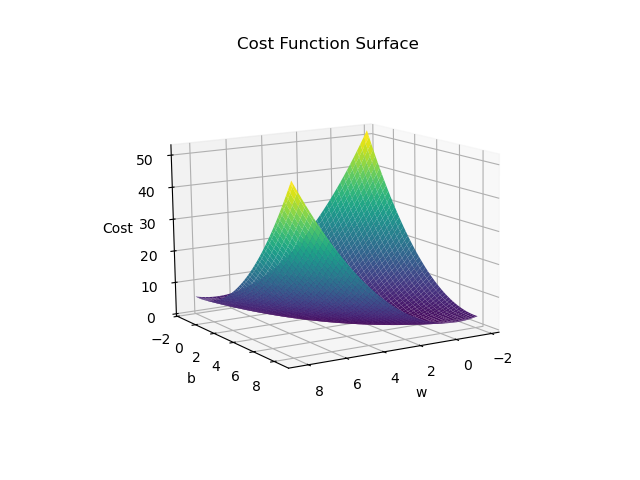
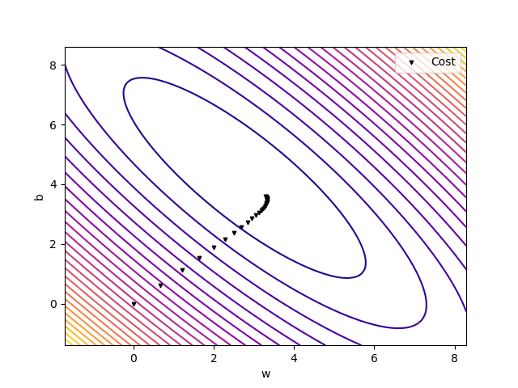

# 📈 Linear Regression from Scratch (Gradient Descent + Visualizations)

This is a simple project where I built **Linear Regression** completely from scratch using just **NumPy** and **Matplotlib**.  
The main goal was not just to train a model, but to actually **see how it learns** step by step.  

I also added a bunch of visualizations to make the process more intuitive: regression lines updating, the cost function surface, and even contour plots with the gradient descent path.

---

## ✨ Features
- No scikit-learn – just raw **NumPy** math and **Matplotlib** plotting
- Visualizes how the regression line evolves during training
- Plots the cost function in **3D** and as **contours**
- Gradient Descent path is shown directly on the cost landscape

---

## 1. 💾 Dataset
The dataset is entirely synthetic — I created it just for testing and experimentation.  


---

## 2. 📉 Data + Regression Line
Once training starts, the model begins fitting a regression line to the dataset:  


---

## 3. 🎬 Regression Line Evolution
Here’s the fun part — watching the regression line slowly adjust itself to fit the data:  


---

## 4. 🌄 Cost Function (3D Surface)
The cost function \( J(w, b) \) plotted in 3D.  
This helps visualize how gradient descent is “rolling downhill” towards the minimum:  



---

## 5. 🌀 Contour Plot of Cost Function
And here’s the 2D contour plot of the same cost function.  
The black markers show the path gradient descent took while updating \( w \) and \( b \):  



---

## 🚀 How to Run
Clone the repo and just run the notebook:

```bash
git clone https://github.com/devilmaycar/Linear-Regression-From-Scratch-With-Visualization.git
cd Linear-Regression-From-Scratch-With-Visualization
jupyter notebook

